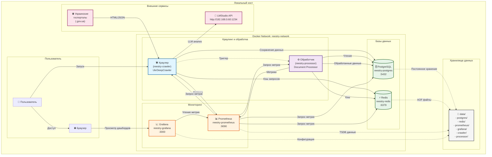
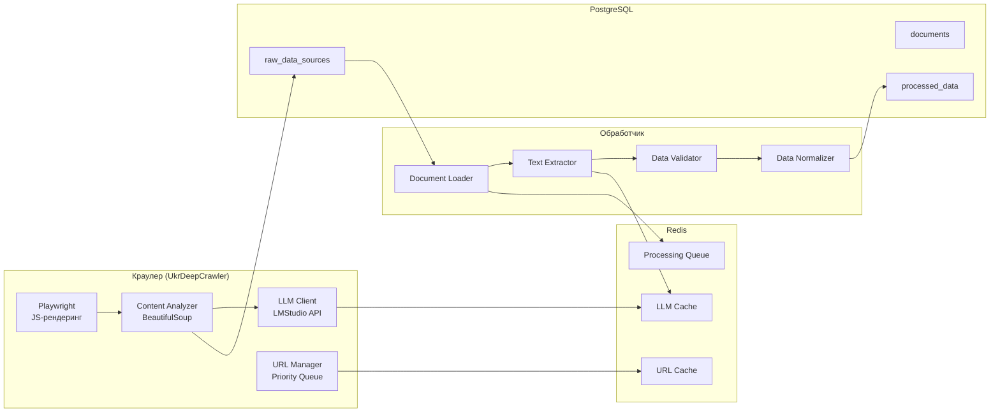
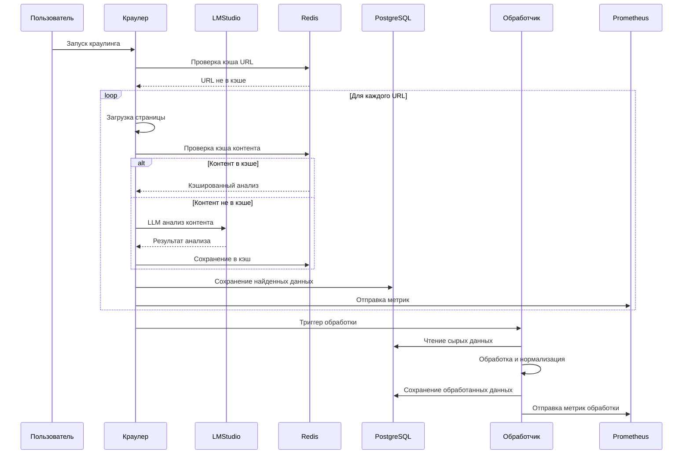
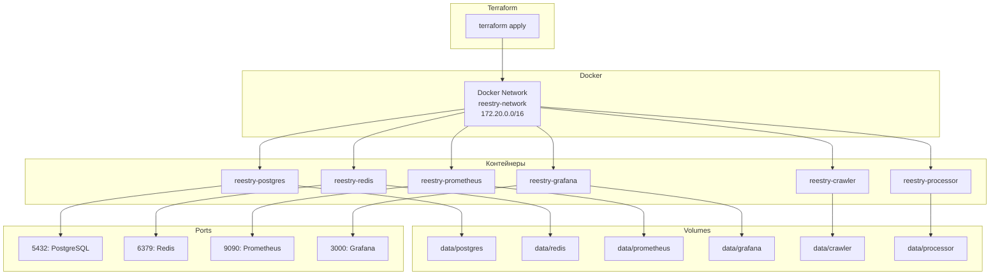

# Архитектура системы REESTRY

## High-Level Architecture Diagram

```mermaid
graph TB
    subgraph "Локальный хост"
        subgraph "Docker Network: reestry-network"
            subgraph "Краулинг и обработка"
                Crawler["🕷️ Краулер<br/>(reestry-crawler)<br/>UkrDeepCrawler"]
                Processor["⚙️ Обработчик<br/>(reestry-processor)<br/>Document Processor"]
            end
            
            subgraph "Базы данных"
                PG[(🗄️ PostgreSQL<br/>reestry-postgres<br/>:5432)]
                Redis[(⚡ Redis<br/>reestry-redis<br/>:6379)]
            end
            
            subgraph "Мониторинг"
                Prom["📊 Prometheus<br/>reestry-prometheus<br/>:9090"]
                Graf["📈 Grafana<br/>reestry-grafana<br/>:3000"]
            end
        end
        
        subgraph "Внешние сервисы"
            LMStudio["🤖 LMStudio API<br/>http://192.168.0.60:1234"]
            WebSources["🌐 Украинские<br/>госпорталы<br/>(.gov.ua)"]
        end
        
        subgraph "Пользователь"
            User["👤 Пользователь"]
            Browser["🌐 Браузер"]
        end
        
        subgraph "Хранилище данных"
            DataDir["📁 data/<br/>- postgres/<br/>- redis/<br/>- prometheus/<br/>- grafana/<br/>- crawler/<br/>- processor/"]
        end
    end
    
    %% Потоки данных краулера
    User -->|"Запуск"| Crawler
    Crawler -->|"LLM анализ"| LMStudio
    WebSources -->|"HTML/JSON"| Crawler
    Crawler -->|"Кэш запросов"| Redis
    Crawler -->|"Сохранение данных"| PG
    Crawler -->|"Метрики"| Prom
    
    %% Потоки данных обработчика
    Crawler -.->|"Триггер"| Processor
    Processor -->|"Чтение"| PG
    Processor -->|"Кэш"| Redis
    Processor -->|"Обработанные данные"| PG
    Processor -->|"Метрики"| Prom
    
    %% Мониторинг
    Prom -->|"Запрос метрик"| Crawler
    Prom -->|"Запрос метрик"| Processor
    Prom -->|"Запрос метрик"| PG
    Prom -->|"Запрос метрик"| Redis
    Graf -->|"Чтение метрик"| Prom
    Browser -->|"Просмотр дашбордов"| Graf
    User -->|"Доступ"| Browser
    
    %% Хранилище
    PG -.->|"Постоянное хранение"| DataDir
    Redis -.->|"AOF файлы"| DataDir
    Prom -.->|"TSDB данные"| DataDir
    Graf -.->|"Конфигурация"| DataDir
    
    %% Стили
    classDef crawlerStyle fill:#e1f5ff,stroke:#01579b,stroke-width:2px
    classDef processorStyle fill:#f3e5f5,stroke:#4a148c,stroke-width:2px
    classDef dbStyle fill:#e8f5e9,stroke:#1b5e20,stroke-width:2px
    classDef monitorStyle fill:#fff3e0,stroke:#e65100,stroke-width:2px
    classDef externalStyle fill:#fce4ec,stroke:#880e4f,stroke-width:2px
    classDef storageStyle fill:#f5f5f5,stroke:#424242,stroke-width:2px
    
    class Crawler crawlerStyle
    class Processor processorStyle
    class PG,Redis dbStyle
    class Prom,Graf monitorStyle
    class LMStudio,WebSources externalStyle
    class DataDir storageStyle
```

## Детальная архитектура компонентов

```mermaid
graph LR
    subgraph "Краулер (UkrDeepCrawler)"
        C1["Playwright<br/>JS-рендеринг"]
        C2["LLM Client<br/>LMStudio API"]
        C3["URL Manager<br/>Priority Queue"]
        C4["Content Analyzer<br/>BeautifulSoup"]
    end
    
    subgraph "Обработчик"
        P1["Document Loader"]
        P2["Text Extractor"]
        P3["Data Validator"]
        P4["Data Normalizer"]
    end
    
    subgraph "PostgreSQL"
        PG1["raw_data_sources"]
        PG2["documents"]
        PG3["processed_data"]
    end
    
    subgraph "Redis"
        R1["LLM Cache"]
        R2["URL Cache"]
        R3["Processing Queue"]
    end
    
    C1 --> C4
    C4 --> C2
    C2 --> R1
    C3 --> R2
    C4 --> PG1
    
    PG1 --> P1
    P1 --> P2
    P2 --> P3
    P3 --> P4
    P4 --> PG3
    
    P1 --> R3
    P2 --> R1
```

## Поток данных

```mermaid
sequenceDiagram
    participant U as Пользователь
    participant C as Краулер
    participant L as LMStudio
    participant R as Redis
    participant P as PostgreSQL
    participant PR as Обработчик
    participant M as Prometheus
    
    U->>C: Запуск краулинга
    C->>R: Проверка кэша URL
    R-->>C: URL не в кэше
    
    loop Для каждого URL
        C->>C: Загрузка страницы
        C->>R: Проверка кэша контента
        alt Контент в кэше
            R-->>C: Кэшированный анализ
        else Контент не в кэше
            C->>L: LLM анализ контента
            L-->>C: Результат анализа
            C->>R: Сохранение в кэш
        end
        
        C->>P: Сохранение найденных данных
        C->>M: Отправка метрик
    end
    
    C->>PR: Триггер обработки
    PR->>P: Чтение сырых данных
    PR->>PR: Обработка и нормализация
    PR->>P: Сохранение обработанных данных
    PR->>M: Отправка метрик обработки
```

## Инфраструктура развертывания

```mermaid
graph TB
    subgraph "Terraform"
        TF["terraform apply"]
    end
    
    subgraph "Docker"
        DN["Docker Network<br/>reestry-network<br/>172.20.0.0/16"]
    end
    
    subgraph "Контейнеры"
        C1["reestry-crawler"]
        C2["reestry-processor"]
        C3["reestry-postgres"]
        C4["reestry-redis"]
        C5["reestry-prometheus"]
        C6["reestry-grafana"]
    end
    
    subgraph "Volumes"
        V1["data/postgres"]
        V2["data/redis"]
        V3["data/prometheus"]
        V4["data/grafana"]
        V5["data/crawler"]
        V6["data/processor"]
    end
    
    subgraph "Ports"
        P1["5432: PostgreSQL"]
        P2["6379: Redis"]
        P3["9090: Prometheus"]
        P4["3000: Grafana"]
    end
    
    TF --> DN
    DN --> C1
    DN --> C2
    DN --> C3
    DN --> C4
    DN --> C5
    DN --> C6
    
    C3 --> V1
    C4 --> V2
    C5 --> V3
    C6 --> V4
    C1 --> V5
    C2 --> V6
    
    C3 --> P1
    C4 --> P2
    C5 --> P3
    C6 --> P4
```

